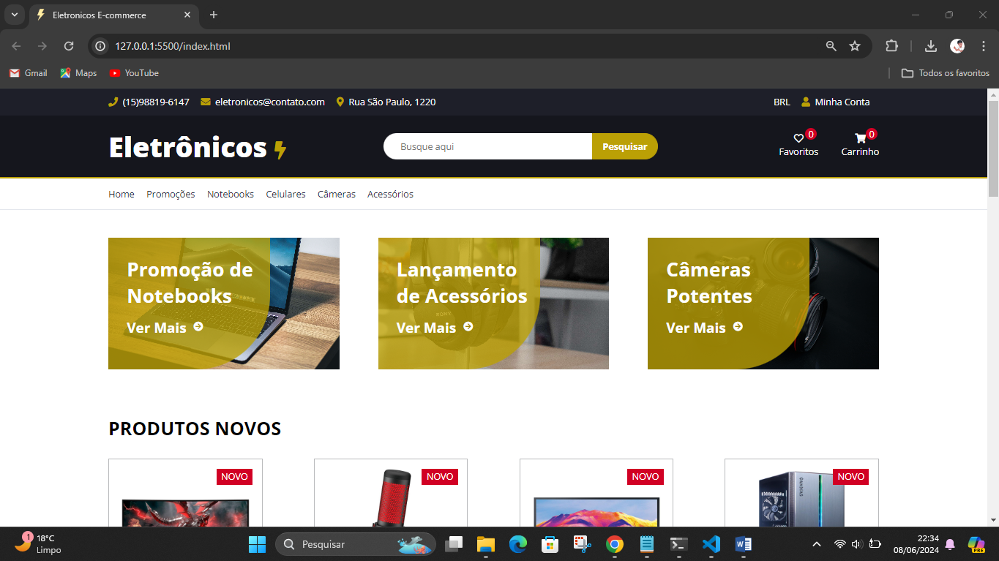

# Site Comércio Eletrônico
Esse é um site de uma loja de eletros eletrônicos.

 ### 👨‍💻 Tecnologias usadas
 - HTML 5
 - SASS
 - SCSS

 ### 🔗 link do Projeto
 [Ir para o projeto](https://deft-sprinkles-97430a.netlify.app/)

 **Frontend:**
 - staks do front
 > Html5, CSS3, JavaScript e Sass

### 🙋 Autores / Colaboradores
* **Matheus Batist** - *professor* - [Matheus Batist](link.git)
* **jailson dev** - *FrontEnd do projeto* - [jailson](www.google.com)

### 🔗 Licença
Esse projeto está sob a licença ( Livre ) - acesse os detatlhes [LICENSE.md](www.google.com).

### 🫂 Gratidão agradecimentos
- Obrigado por acompanha o meu projeto até aqui.
- Email de contato para: __jailson.nogueira2@gmail.com__
- WhatsApp: __159 8819-6147__
- LinkeDin: [meu_linkedin](https://www.linkedin.com/in/jailsonn-silva/)

